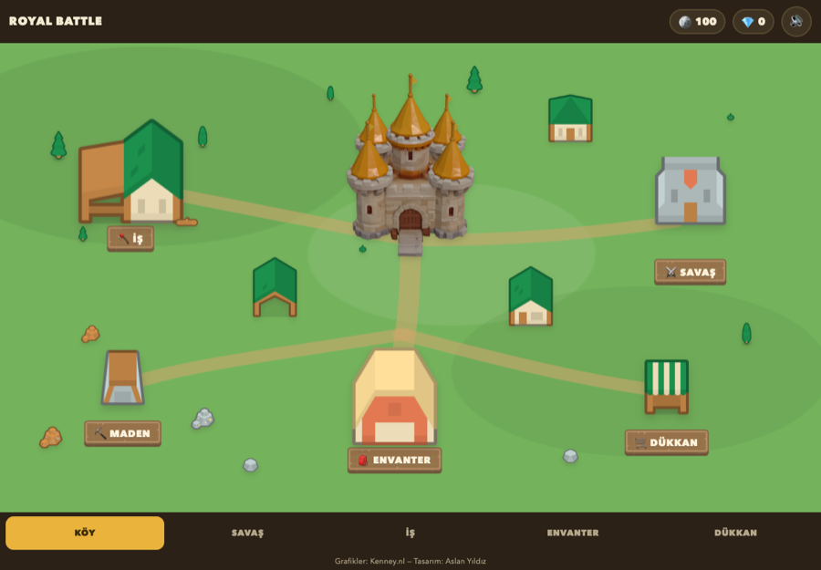

# Royal Battle

Aslan Yıldız'ın kendi çizimlerinden ve kendi belirlediği statlardan yapılmış, tarayıcıda çalışan bir **köy-kur + savaş** oyunu. Kurulum yok, bağımlılık yok: statik HTML/CSS/JS. iPad Safari'de ve masaüstünde çalışır.



## Oyun

| Ekran | Ne yapılır |
| --- | --- |
| 🏰 **Köy** | 2D harita; binalara dokununca ilgili ekran açılır. |
| ⚔️ **Savaş** | Kule–nehir–köprü arenası. İksir dolar, kart seçilir, sahaya sürülür. Her 5. seviye boss. |
| 🪓 **İş** | Odun kesme; odun başına 2 🪙. |
| ⛏️ **Maden** | 8 kaya, her biri 3 dokunuşta kırılır; %35 ihtimalle 1–3 💎. |
| 🎒 **Envanter** | Toplanan eşyalar (kalkan, kılıç, yay, tüfek, iksirler). |
| 🛒 **Dükkan** | Karakter satın alma (🪙 / 💎) ve eşya satma. |

Kayıt `localStorage`'a yazılır (`royal-battle-save-v1`), sunucu yok.

## Yerelde çalıştırma

ES modülleri kullanıldığı için dosyayı çift tıklayarak açmak yetmez, bir sunucu gerekir:

```sh
./serve.sh              # python3 -m http.server 8080
open http://localhost:8080
```

Geliştirme kısayolları (URL):

| Parametre | Etki |
| --- | --- |
| `#savas`, `#is`, `#maden`, … | Karşılama ekranını atlayıp doğrudan o ekranı açar. |
| `?autobattle=1` | Savaş ekranını açar ve bir savaşçıyı otomatik sürer (headless smoke testi). |
| `?debug=1` | JS hatalarını sayfanın altına yazar (iPad'de teşhis için). |

Ekran görüntüsü almak için:

```sh
./shot.sh cikti.png "#koy" 10     # <dosya> [url-fragment] [bekleme-sn]
```

## Testler

Saf mantık (denge, durum, simülasyon, ekonomi) Node'un yerleşik test koşucusuyla test edilir — DOM veya Three.js gerekmez:

```sh
node --test "tests/*.test.mjs"
```

> Not: `node --test tests/` çalışmaz, glob'u tırnak içinde vermek gerekir.

## Proje yapısı

```text
index.html            tek sayfa; ekranlar <section> olarak burada
css/game.css          tek tema (gündüz köy), palet :root'ta
js/state.js           saf oyun durumu — DOM/Three.js import ETMEZ
js/balance.js         saf denge verisi (statlar, fiyatlar, düşman dalgaları)
js/screens.js         sekme/ekran yönlendirmesi
js/village/map.js     2D köy haritası
js/battle/scene.js    savaş sahnesi (Three.js)
js/battle/sim.js      savaş simülasyonu (saf, test edilebilir)
js/ui/*               HUD, iş, maden, envanter, dükkan, ses
vendor/               Three.js + GLTFLoader (kopya, CDN yok)
assets/               kartlar, Kenney spriteları, kale render'ı, ikonlar
tests/                node:test testleri
```

**Değiştirmeyin:** `js/balance.js` içindeki karakter statları Aslan'ın tasarım kararıdır; `tests/balance.test.mjs` bunları spec tablosuna karşı kilitler.

## İkonlar


| Dosya | Kullanım |
| --- | --- |
| `favicon.svg` | Ana ikon — vektör, her boyutta net. |
| `favicon-32.png` | SVG favicon desteklemeyen tarayıcılar için yedek. |
| `apple-touch-icon.png` (180×180) | iPad/iPhone "Ana Ekrana Ekle". Opak ve köşesiz; maskeyi iOS uygular. |
| `assets/icon/icon-192.png`, `icon-512.png` | Web manifest ikonları (`any maskable`). |
| `site.webmanifest` | Ad, tema rengi, tam ekran + yatay yönelim. |

Tasarım oyunun paletinden gelir: koyu mürekkep zemin (`--ink #2B2117`) üzerinde altın taç (`--gold #E9B33C`).

PNG'ler `favicon.svg`'den üretilir. Yeniden üretmek gerekirse Chrome'u **512×512'de** çalıştırıp `sips` ile küçültün — macOS'ta Chrome'un minimum pencere genişliği yüzünden doğrudan küçük boy render bozuk çıkar:

```sh
# favicon.svg'yi bir HTML'e gömüp 512'de ekran görüntüsü al, sonra:
sips -z 192 192 icon-512.png --out assets/icon/icon-192.png
sips -z 32  32  icon-512.png --out favicon-32.png
```

## Dağıtım

Vercel'de statik olarak yayınlanır; build adımı yok. `.vercelignore` testleri, dokümanları ve büyük kaynak modellerini dışarıda bırakır.

```sh
vercel --prod
```

## Krediler

- **Tasarım, karakterler ve statlar:** Aslan Yıldız
- **2D/3D grafikler:** [Kenney.nl](https://kenney.nl) — Retro Fantasy Kit + Blocky Characters, CC0 1.0
- **Kale modeli:** Tripo ile üretildi, 2D sprite olarak render edildi
- **Karakter kartları:** Canva'da 3D render stilinde hazırlandı
